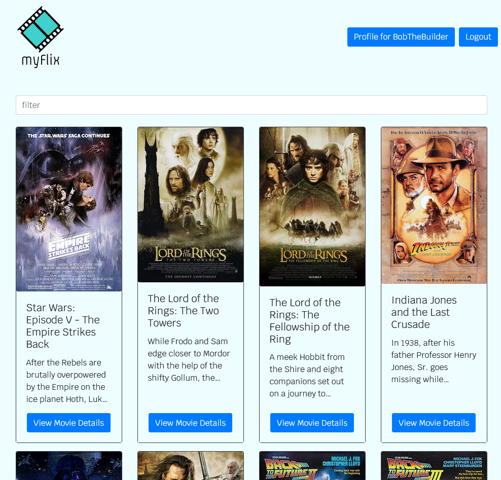

# myFlix Client with React
As part of my larger 'myFlix' project (a website designed to be a movie database, similar to [IMDB](https://www.imdb.com/)), this is the frontend logic primarily built using React.

## Purpose
The purpose of the myFlix site is to get exposure to and practice using the full MERN stack, building a full stack website in the process. This part in particular is the frontend logic built with React, which displays the user interface and allows the user to interact with the server.

## Technologies Used
* React
* React Bootstrap
* Redux

## Usage
A live version of the website can be found here (hosted using Netlify) - https://t-dogg-myflix-react.netlify.app/
### Landing Page
The site will default to the login page. Register a new user and then log in!

### Movies Page
After logging in the user will be directed to the full list of movies within the database. From here, the user can navigate to their user profile page, see more details about a movie and add it to their favourites list.

### User Profile Page
From the user profile page, the user can see their list of favourite movies, update their user details or delete their user profile.